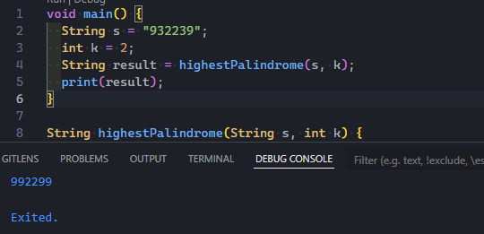

## 1. Weighted Strings

## 2. Balanced Bracket

Complexity : Low

- When we encounter an opening bracket, we push it onto the stack.

- When we encounter a closing bracket, we pop the last element of the stack and check if this last element key corresponds to the current closing bracket value using the map.

- If they match, we continue. If not, the string is unbalanced.

- Finally, if the stack is empty, it means all the brackets were matched correctly, indicating a balanced string.

## 3. Highest Palindrome

